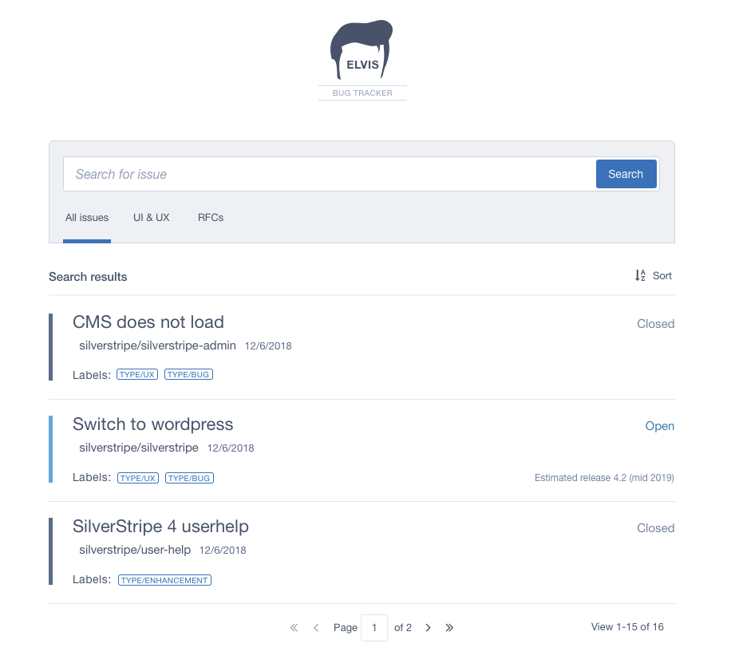

# Github Issue Searcher

## Overview

This app uses the Github issue search API to provide
a convenient issue browser across all of our
[supported modules](https://www.silverstripe.org/software/addons/silverstripe-commercially-supported-module-list/).

It uses [vue-cli](https://github.com/vuejs/vue-cli/blob/dev/docs/cli.md)
to simplify local development and production buidls for VueJS.
You can use it on https://silverstripeltd.github.io/github-issue-search-client/



## Install

Use Node v8 or higher.

```
npm install
```

## Configure

Create an `.env` with:

```
VUE_APP_GRAPHQL_ENDPOINT=https://api.github.com
VUE_APP_GRAPHQL_TOKEN=<token>
```

Get a [Github Personal Access Token](https://github.com/settings/tokens) and chuck it in `<token>`.
Note that the token should NOT have any other permissions/scopes, since it will be included
in the client bundle (and is readable by everyone through network requests).
The only reason to include it here is avoiding to hit Github's rate limits without it.

In order to get an updated list of our [supported modules](https://www.silverstripe.org/software/addons/silverstripe-commercially-supported-module-list/),
you can run the following command, and save the output to `VUE_APP_REPO_GROUPS`
in the `.env.` file:

```
node util/get-supported-module-env.js
```

## Run locally

```
npm run serve
```

## Build

```
npm run build
```

## Deploy

The project is published to public access [Github Pages](https://cli.vuejs.org/guide/deployment.html#github-pages) by default.

```
./deploy.sh
```

## Usage

